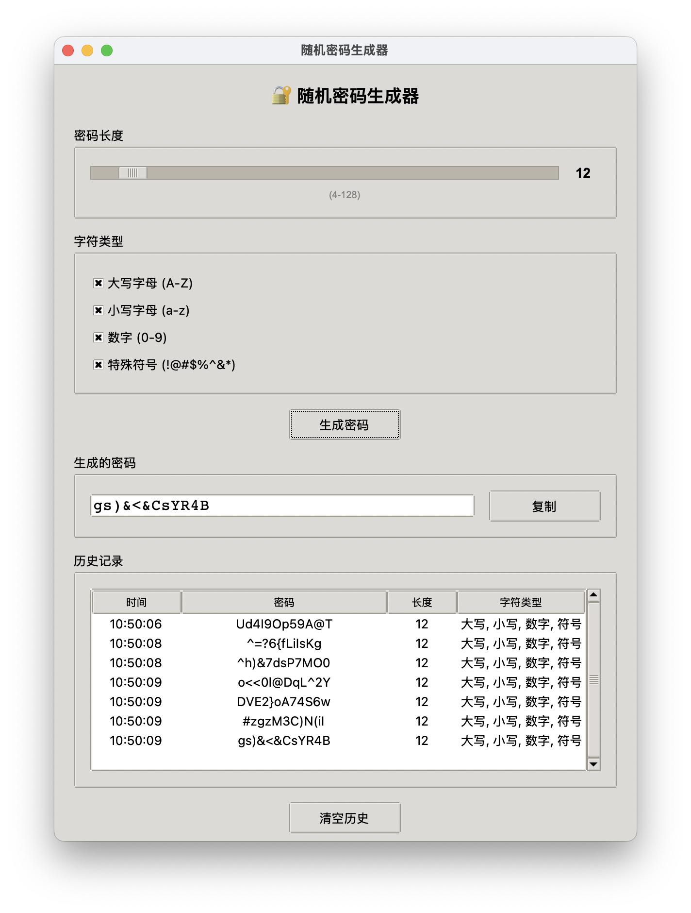

# 🔐 随机密码生成器

[](https://www.python.org/downloads/)
[](LICENSE)
[](https://www.apple.com/macos/)
[](https://pyinstaller.org/)

一个功能完整的Python GUI随机密码生成器，支持打包成macOS应用程序。具有现代化的用户界面和丰富的功能特性。

## ✨ 主要功能

- **🔢 密码长度设置**: 支持4-128位密码长度，通过滑块直观调节
- **🔤 字符类型选择**: 可选择性包含大写字母、小写字母、数字和特殊符号
- **⚡ 实时生成**: 点击按钮即可生成符合要求的随机密码
- **📋 一键复制**: 生成的密码可直接复制到剪贴板
- **📚 历史记录**: 保存最近生成的20个密码，包含时间、长度和字符类型信息
- **🖱️ 双击复制**: 双击历史记录中的密码可直接复制使用
- **🗑️ 清空历史**: 支持清空所有历史记录
- **🍎 macOS原生**: 可打包成独立的macOS应用程序

## 📱 界面预览



*应用主界面，展示密码长度设置、字符类型选择、密码生成和历史记录等功能区域*

## 🚀 快速开始

### 直接运行

```bash
# 克隆项目
git clone https://github.com/yourusername/password-generator.git
cd password-generator

# 运行程序
python password_generator.py
```

### 打包成macOS应用

```bash
# 安装依赖
pip install pyinstaller

# 运行打包脚本
python build_macos_app.py

# 应用将生成在 dist/ 目录中
```

## 📋 系统要求

- **Python**: 3.6+
- **操作系统**: macOS 10.13+ (推荐), Windows, Linux
- **依赖**: 仅使用Python标准库，无需额外安装

## 🎯 使用说明

1. **设置密码长度**: 拖动滑块选择4-128之间的密码长度
2. **选择字符类型**: 勾选需要包含的字符类型
   - 大写字母 (A-Z)
   - 小写字母 (a-z)
   - 数字 (0-9)
   - 特殊符号 (!@#$%^&*)
3. **生成密码**: 点击"生成密码"按钮
4. **复制密码**: 点击"复制"按钮或双击历史记录中的密码
5. **查看历史**: 在历史记录区域查看最近生成的密码
6. **清空历史**: 点击"清空历史"按钮清除所有记录

## 🔧 技术特点

- **GUI框架**: 使用tkinter构建原生GUI界面
- **响应式布局**: 支持窗口大小调整，适配不同屏幕尺寸
- **安全算法**: 使用Python内置的random模块生成随机密码
- **错误处理**: 优雅的用户提示和错误处理
- **中文支持**: 完全中文化的用户界面
- **跨平台**: 支持Windows、macOS和Linux

## 📱 macOS应用特性

- **完全独立**: 无需Python环境，直接运行
- **原生体验**: 符合macOS设计规范
- **轻量级**: 应用大小约38.5MB（包含完整Python环境）
- **高性能**: 启动快速，运行流畅
- **系统集成**: 支持拖拽安装到Applications文件夹

## 🏗️ 项目结构

```
password-generator/
├── password_generator.py      # 主程序
├── build_macos_app.py         # macOS打包脚本
├── requirements.txt           # 依赖说明
├── README.md                 # 项目说明
├── INSTALL.md                # 安装说明
├── .gitignore                # Git忽略文件
└── dist/                     # 打包输出目录
    └── 随机密码生成器.app      # macOS应用
```

## 🛠️ 开发环境

### 本地开发

```bash
# 克隆项目
git clone https://github.com/yourusername/password-generator.git
cd password-generator

# 创建虚拟环境（可选）
python -m venv venv
source venv/bin/activate  # macOS/Linux
# 或
venv\Scripts\activate     # Windows

# 运行程序
python password_generator.py
```

### 打包应用

```bash
# 安装打包工具
pip install pyinstaller

# 运行打包脚本
python build_macos_app.py
```

## 🤝 贡献指南

我们欢迎所有形式的贡献！

### 如何贡献

1. **Fork** 这个项目
2. 创建你的特性分支 (`git checkout -b feature/AmazingFeature`)
3. 提交你的更改 (`git commit -m 'Add some AmazingFeature'`)
4. 推送到分支 (`git push origin feature/AmazingFeature`)
5. 打开一个 **Pull Request**

### 贡献类型

- 🐛 Bug修复
- ✨ 新功能
- 📚 文档改进
- 🎨 UI/UX改进
- 🧪 测试用例
- 🔧 代码优化

## 📄 许可证

本项目采用 [MIT License](LICENSE) 许可证 - 查看 [LICENSE](LICENSE) 文件了解详情。

## 🙏 致谢

- [Python](https://www.python.org/) - 编程语言
- [tkinter](https://docs.python.org/3/library/tkinter.html) - GUI框架
- [PyInstaller](https://pyinstaller.org/) - 应用打包工具
- [GitHub](https://github.com/) - 代码托管平台

## 📞 联系方式

- **项目主页**: [https://github.com/kami-lab7/PasswordGenerator](https://github.com/kami-lab7/PasswordGenerator)
- **问题反馈**: [Issues](https://github.com/kami-lab7/PasswordGenerator/issues)
- **功能建议**: [Discussions](https://github.com/kami-lab7/PasswordGenerator/discussions)

## ⭐ 如果这个项目对你有帮助，请给我们一个星标！

---

**Made with ❤️ by Kami Lab**

